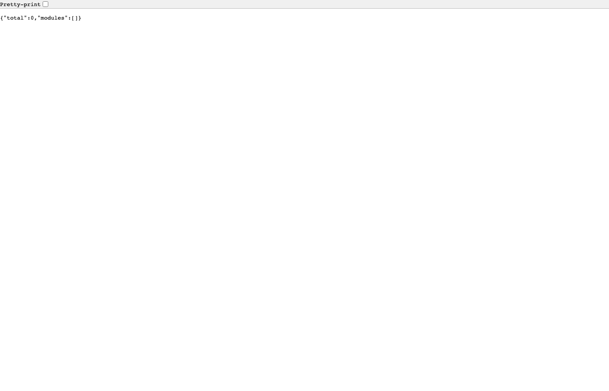
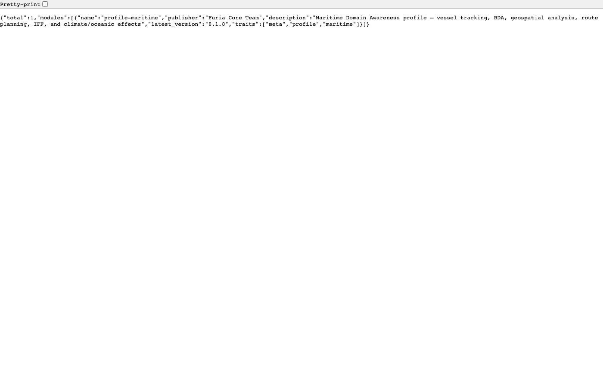
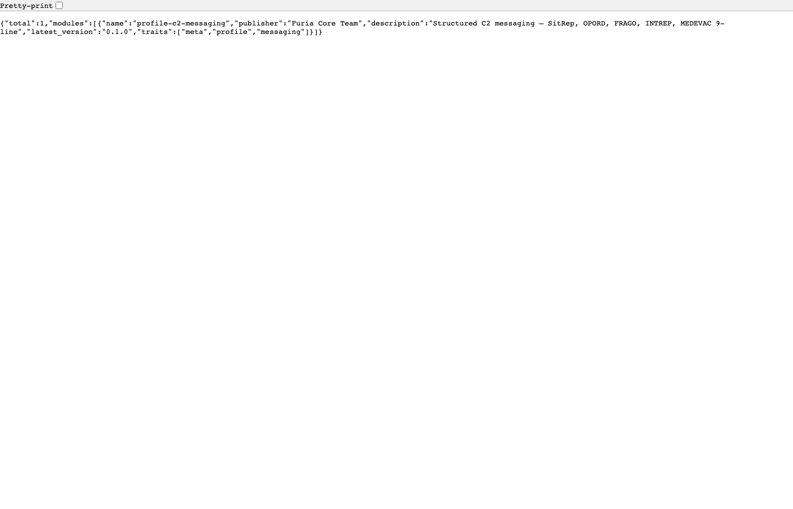

# C2 Templates

```
┌─────────────────────────────────────────────────────────┐
│                   C2 Templates                           │
├────────────┬──────────┬──────────┬──────────────────────┤
│            │          │          │                      │
│  C2 HQ     │Frontline │  Edge    │    Intelligence      │
│  Full Cmd  │Tactical  │Vehicle  │    Fusion & ISR      │
│  Post      │C2        │C2       │                      │
│            │          │          │                      │
├────────────┼──────────┼──────────┼──────────────────────┤
│            │          │          │                      │
│  Maritime  │ Airborne │C2        │    + Environment     │
│  Naval C2  │MUM-T C2  │Messaging │    Configs           │
│            │          │          │                      │
└────────────┴──────────┴──────────┴──────────────────────┘
```

Seven C2 templates, each designed for a specific operational role.
All built from the same codebase — different profiles select different
service combinations.

## How Templates Work

```bash
# Pick your template
cargo run --release -p furia-market -- install profile-c2-hq

# (Optional) Add an environment config
cargo run --release -p furia-market -- install profile-env-denied

# Run it — only the services you need start
```

## The 7 Templates

### 1. 🏛 C2 Headquarters — `profile-c2-hq`

Full command post for strategic/operational-level C2.

| Capability | Services |
|-----------|----------|
| Common Operating Picture | interop-gateway, cop-service |
| Force Tracking | friendly-force-tracking |
| Intelligence Fusion | intel-services, all-source-intel-fusion |
| Mission Planning | mission-orchestrator, mission-planner |
| BDA Assessment | bda-service |
| IHL/ROE Enforcement | policy-service |
| C2 Messaging | military-messaging |

**Services:** 7 core | **Postgres:** Required | **Best for:** Brigade HQ, Division HQ

```bash
furia-market install profile-c2-hq
```

### 2. 🔭 C2 Frontline — `profile-c2-frontline`

Tactical C2 for dismounted units and forward observers.

| Capability | Services |
|-----------|----------|
| Blue Force Tracking | friendly-force-tracking |
| Route Analysis | route-analysis |
| MEDEVAC/CASEVAC | full-spectrum-csar |
| Tactical Graphics | durandal-tactical-graphics (extension) |
| C2 Messaging | military-messaging |

**Services:** 4 core | **Postgres:** Optional | **Best for:** Platoon, Company

```bash
furia-market install profile-c2-frontline
```

### 3. 🚛 C2 Edge — `profile-c2-edge`

Lightweight vehicle-mounted C2 for AFV/IFV crews. Minimal compute footprint.

| Capability | Services |
|-----------|----------|
| Situational Awareness | interop-gateway |
| Force Tracking | friendly-force-tracking |
| C2 Messaging | military-messaging |
| IHL Gating | policy-service |

**Services:** 4 core | **Postgres:** Not required (memory mode) | **Best for:** AFV, IFV, vehicle crew

```bash
furia-market install profile-c2-edge
```

### 4. ⚓ C2 Maritime — `profile-maritime`

Naval domain awareness — vessel tracking, BDA, route planning.

| Capability | Services |
|-----------|----------|
| BDA Assessment | bda-service |
| Geospatial Intel | geospatial-service |
| Route Planning | route-analysis |
| IFF | durandal-iff (extension) |
| Climate Effects | durandal-climate (extension) |

**Services:** 3 core | **Postgres:** Optional | **Best for:** Maritime HQ, Coastal Defense

```bash
furia-market install profile-maritime
```

### 5. 🚁 C2 Airborne — `profile-mum-t`

Air C2 with manned-unmanned teaming.

| Capability | Services |
|-----------|----------|
| MUM-T Coordination | sics-adapter |
| Airspace Management | airspace-service |
| Force Tracking | friendly-force-tracking |
| Collaborative Engagement | durandal-collaborative-engagement (extension) |
| IFF | durandal-iff (extension) |

**Services:** 3 core | **Postgres:** Optional | **Best for:** Aviation Brigade, MUM-T Cell

```bash
furia-market install profile-mum-t
```

### 6. 🧠 C2 Intelligence — `profile-intel-analysis`

Intelligence fusion — all-source analysis, cyber threat, cross-cue.

| Capability | Services |
|-----------|----------|
| All-Source Fusion | all-source-intel-fusion |
| Intel Services | intel-services |
| Cross-Cue | joint-intel-cross-cue |
| Cyber Threat | cyber-threat-intel |
| Document Exploitation | document-exploitation |

**Services:** 5 core | **Postgres:** Optional | **Best for:** J2, Intelligence Battalion

```bash
furia-market install profile-intel-analysis
```

### 7. 📨 C2 Messaging — `profile-c2-messaging`

Structured military messaging — independent of other C2 templates.

| Capability | Services |
|-----------|----------|
| SitRep (STANAG 2022) | military-messaging |
| OPORD/FRAGO/WARNORD | military-messaging |
| MEDEVAC 9-Line | military-messaging |
| INTREP | military-messaging |

**Services:** 1 core | **Postgres:** Optional | **Best for:** Any echelon, augment existing C2

```bash
furia-market install profile-c2-messaging
```

## Environment Configs

Stack any template with an environment profile:

```bash
# C2 HQ in contested spectrum
furia-market install profile-c2-hq
furia-market install profile-env-contested

# C2 Frontline in GNSS-denied environment
furia-market install profile-c2-frontline
furia-market install profile-env-denied
```

| Environment | Effect | Profile |
|------------|--------|---------|
| Permissive | Full GNSS, clear comms | `profile-env-permissive` |
| Denied | GNSS jammed, comms intermittent | `profile-env-denied` |
| Contested | EW active, spectrum contested | `profile-env-contested` |

## Screenshots

Each template has a marketplace profile page showing its available extensions:


*C2 Headquarters — 7 services, COP, intel, planning, IHL, messaging*


*C2 Frontline — 4 services, BFT, MEDEVAC, route analysis*


*C2 Edge — 4 services, lightweight vehicle C2, no Postgres needed*


*C2 Maritime — 3 services, vessel tracking, BDA, routing*


*C2 Airborne — 3 services, MUM-T, airspace, IFF*


*C2 Intelligence — 5 services, all-source fusion, cyber, cross-cue*


*C2 Messaging — 1 service, SitRep, OPORD, MEDEVAC 9-line*

## Comparison

| Template | Services | Postgres | RAM | Best For |
|----------|----------|----------|-----|----------|
| **C2 HQ** | 7 | Required | 4 GB | Brigade HQ, Division HQ |
| **C2 Frontline** | 4 | Optional | 2 GB | Platoon, Company |
| **C2 Edge** | 4 | Not needed | 1 GB | AFV/IFV crew |
| **C2 Maritime** | 3 | Optional | 2 GB | Naval HQ |
| **C2 Airborne** | 3 | Optional | 2 GB | Aviation |
| **C2 Intelligence** | 5 | Optional | 2 GB | J2 |
| **C2 Messaging** | 1 | Optional | 512 MB | Any echelon |
