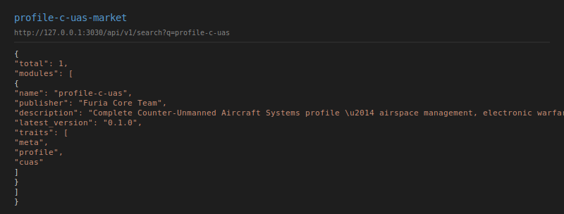

# Counter-UAS (C-UAS) — `profile-c-uas`

Full counter-drone C2 with airspace management, electronic warfare, IFF,
force protection, and C-UAS threat scoring.

## Services

| Service | Port | Purpose |
|---------|------|---------|
| `counter-uas-director` | 3475 | Swarm custody, EMCON, cue audit |
| `sapient-adapter` | 3395 | SAPIENT C-UAS detection/fusion ingest |
| `airspace-service` | 3050 | Airspace management, killboxes |

## Extensions

| Extension | Kind | Purpose |
|-----------|------|---------|
| `durandal-airspace` | policy | Airspace mgmt, restricted ops |
| `durandal-ew` | simulation | Electronic warfare simulation |
| `durandal-iff` | sensor | IFF interrogation |
| `durandal-force-protection` | policy | Force protection |
| `furia-cuas-threat-scorer` | simulation | Threat scoring |

## Health

```json
GET /health
{"status":"healthy","c2_profile":"cuas","loaded_providers":22}
```

## Screenshot



## Quickstart

```bash
# macOS DMG
open FuriaC4ISR.dmg

# Or from source
cargo run --release -p furia-market -- install profile-c-uas
cargo run --release -p counter-uas-director &
cargo run --release -p sapient-adapter &
```

## Compose with Environment

```bash
# C-UAS in contested spectrum
furia-market install profile-c-uas
furia-market install profile-env-contested
```