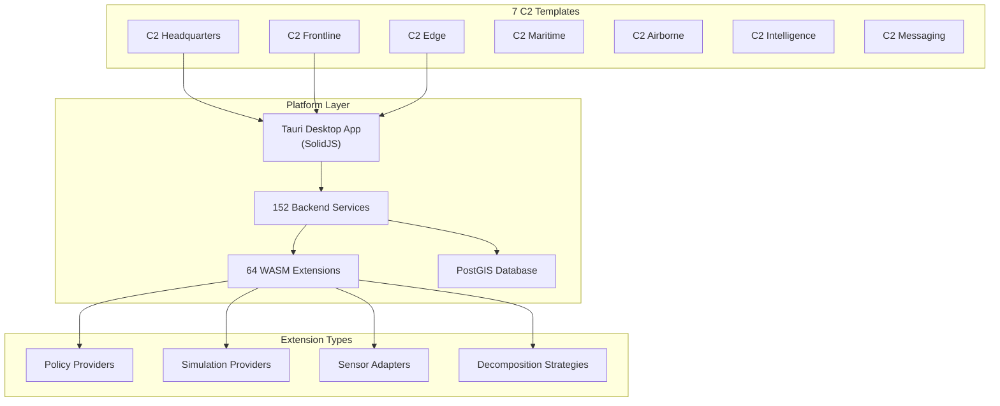

# Furia C2 Platform

**7 C2 templates** · **64 extensions** · **152 services** · **99 marketplace modules**

Furia is a software platform that generates complete C2 systems — from
vehicle-mounted Edge C2 to full Headquarters — from a single codebase,
selectable by mission profile.

## Pick Your Template

| Template | Services | Best For |
|----------|----------|----------|
| **🏛 C2 Headquarters** | 7 | Brigade/Division HQ — full command post |
| **🔭 C2 Frontline** | 4 | Platoon/Company — tactical C2 |
| **🚛 C2 Edge** | 4 | AFV/IFV crew — lightweight vehicle C2 |
| **⚓ C2 Maritime** | 3 | Naval HQ — maritime domain awareness |
| **🚁 C2 Airborne** | 3 | Aviation — MUM-T, airspace mgmt |
| **🧠 C2 Intelligence** | 5 | J2 — intelligence fusion |
| **📨 C2 Messaging** | 1 | Any echelon — military messaging |

## Quickstart

```bash
# Prerequisites: git, Rust, and 'just'
cargo install just

# One-command setup (clones furia-core, builds release, starts gateway)
just setup

# Open the API
open http://localhost:3226/swagger-ui/
```

## API Walkthrough


*Live walkthrough — health endpoint, Swagger UI, marketplace, messaging (9 seconds)*

## Architecture


