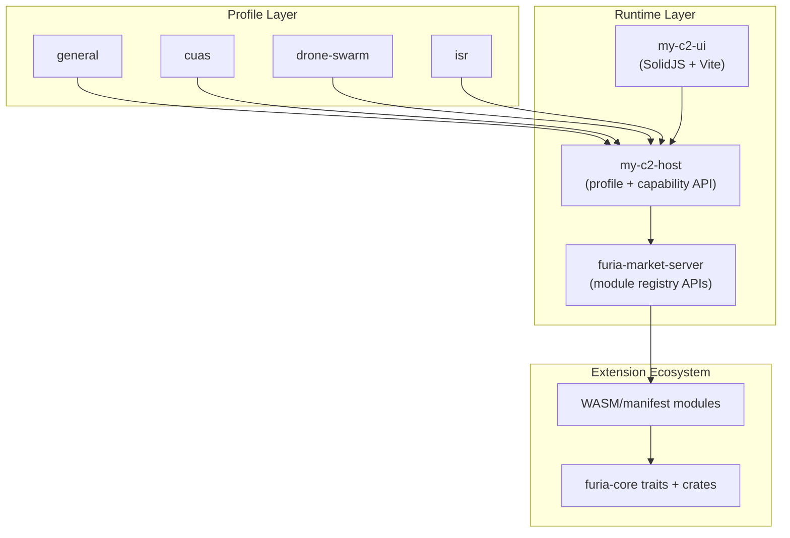

# Furia C2 Platform

**Profile-driven host** · **Standalone UI** · **Marketplace-backed modules**

Furia is a software platform for composing complete C2 systems from reusable
building blocks. Start with a minimal host/UI/market stack, then add mission
services and extensions from the public ecosystem repos.

## Pick Your Starting Profile

| Profile | Best For | Notes |
|----------|----------|----------|
| `general` | Baseline C2 shell | Default starter profile |
| `cuas` | Counter-UAS workflows | Enables C-UAS capability set |
| `drone-swarm` | Swarm operations | Enables swarm-centric capability set |
| `isr` | ISR-heavy missions | Enables ISR-centric capability set |

## Quickstart

```bash
# Prerequisites: git, Rust, Node.js

git clone https://github.com/durandal-robotics/my-c2-host.git
git clone https://github.com/durandal-robotics/furia-market-server.git
git clone https://github.com/durandal-robotics/my-c2-ui.git

# terminal 1
cd my-c2-host
FURIA_C2_PROFILE=general cargo run

# terminal 2
cd ../furia-market-server
cargo run

# terminal 3
cd ../my-c2-ui
npm install
npm run dev
```

## Delivery-Ready Split Repos

For production packaging, use:

- `my-c2-host` (host/runtime)
- `my-c2-ui` (UI artifact)
- `furia-market-server` (module marketplace)

See [Assurance and Proofs](developer-guide/assurance-and-proofs.md) for release gates.

## API Walkthrough


*Live walkthrough — health endpoint, Swagger UI, marketplace, messaging (9 seconds)*

## Architecture


