# Scenario: C-UAS Defense in Contested Spectrum


*Animated walkthrough — detection → assessment → engagement → BDA (12 seconds total)*

## Situation

A step-by-step walkthrough of a complete C2 operation using Furia.

## Situation

A forward operating base (FOB) is under threat from hostile drone swarms.
The enemy is using electronic warfare to jam GNSS and disrupt communications.
The commander needs a C-UAS C2 system that works in contested environments.

## Setup (5 minutes)

```bash
# 1. Deploy the C-UAS template
furia-market install profile-c-uas

# 2. Configure for contested environment
furia-market install profile-env-contested

# 3. Start the services
just gateway
```

## Phase 1: Detection (T+00:00)

A SAPIENT edge sensor detects an unknown UAV at 5 km range.

```
SAPIENT Detection Report
├─ Sensor: EDGE-01 (RADAR)
├─ Classification: HOSTILE_UAS
├─ Confidence: 0.92
├─ Position: 48.856, 2.352 (alt: 150m)
└─ Velocity: 15 m/s, heading 270°
```

The `sapient-adapter` ingests the detection and publishes it to the
C-UAS director via Zenoh. The operator sees the track appear on the
COP with a red hostile icon within 200ms of detection.

## Phase 2: Assessment (T+00:05)

The C-UAS director evaluates the threat:

```
Threat Assessment
├─ Target: UAV-001
├─ Threat Level: HIGH
├─ Intercept Window: 45 seconds
└─ Recommended Action: CUE effector
```

The `policy-service` checks IHL compliance:
- Proportionality check: fuel depot is 200m from the target
- Distinction check: no civilian structures within 500m
- Precaution check: low collateral risk
- **Result: ALLOW**

## Phase 3: Engagement (T+00:10)

The operator confirms the engagement. The `kill-chain` orchestrates:

1. **Task**: C-UAS director tasks the closest effector
2. **Cue**: SAPIENT cue message sent to effector via `sapient-adapter`
3. **Engage**: Effector engages the target
4. **Report**: BDA report generated

```
Engagement Report
├─ Mission: FOB DEFENSE 25-001
├─ Target: UAV-001 (NEUTRALIZED)
├─ Effector: EW-03 (JAMMER)
├─ Time: 12:34:56Z
└─ Outcome: SUCCESS — no collateral damage
```

## Phase 4: BDA (T+00:12)

The `bda-service` produces a BDA report:

```
BDA Report
├─ Strike ID: STRKE-001
├─ Target: UAV-001
├─ Damage Assessment: COMPLETE_KILL
├─ Collateral: NONE
├─ Munitions: 1x JAMMER pulse
└─ Assessment: EFFECTIVE
```

The BDA chain is recorded in the temporal graph (PostGIS + pgRouting)
for future analysis and pattern recognition.

## Timeline

```
T+00:00  Detection — SAPIENT sensor spots UAV
T+00:02  Track appears on COP
T+00:05  Threat assessment complete
T+00:07  IHL check passed
T+00:08  Operator confirms engagement
T+00:10  Effector cued and engaged
T+00:11  UAV neutralized
T+00:12  BDA report generated
T+00:15  All clear — back to monitoring
```

## What the Operator Saw

1. **COP**: Track appeared as red hostile icon on the map
2. **Alert**: Threat assessment popup with IHL result
3. **Confirm**: One-click engagement approval
4. **Result**: BDA report with green "EFFECTIVE" status

## What the Platform Did

| Step | Service | Time |
|------|---------|------|
| Ingest detection | `sapient-adapter` | 50ms |
| Assess threat | `counter-uas-director` | 200ms |
| Check IHL | `policy-service` | 100ms |
| Cue effector | `sapient-adapter` | 50ms |
| Record BDA | `bda-service` | 100ms |
| Store in graph | `furia-graph` | 50ms |
| **Total** | — | **~550ms** |

## Templates Used

- **C2 Airborne** (`profile-mum-t`) — airspace management
- **C2 Messaging** (`profile-c2-messaging`) — internal coordination
- **Environment: Contested** (`profile-env-contested`) — EW-aware config

## See Also

- [C2 Templates](c2-templates.md)
- [Airborne Template](c2-types/mum-t.md)
- [Extension: SAPIENT](extensions/sensor.md)
