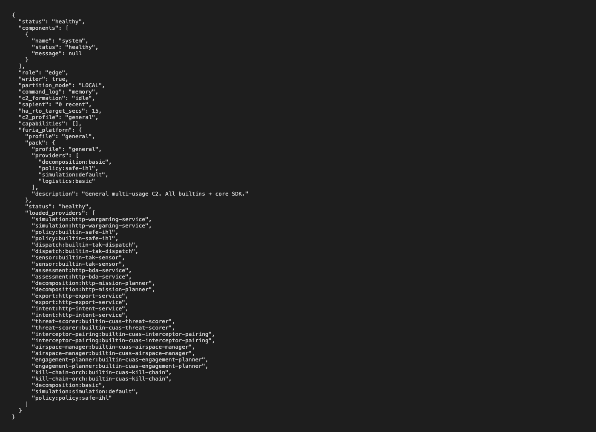
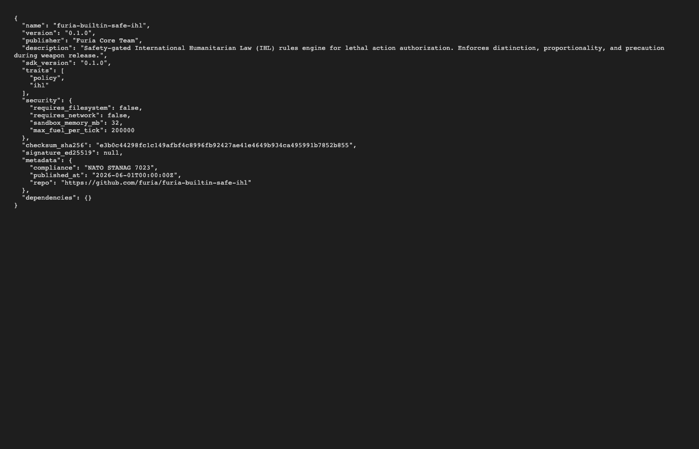

# Screenshot Gallery

Captured from live `FuriaC4ISR.app` running each C2 profile.
Generated automatically by CI every build.

## API Gateway Screens

### Swagger UI (23 Endpoints)

<!-- Screenshots captured by Playwright. Placeholder for generated images. -->


*Interop Gateway API — 23 documented endpoints across 7 tag groups*

### Health Dashboard


*Service health, C2 profile, loaded providers, formation status*

### C2 Formation


*Multi-operator C2 formation with roles and partition mode*

### Prometheus Metrics


*9 Prometheus metrics: requests, formations, CoT events, ATAK connections*

## C2 Profile Screens

### Counter-UAS (C-UAS)


*C-UAS director with threat scoring, EMCON posture, SAPIENT detections*

### C4ISR Headquarters


*Full HQ with COP, intelligence, BDA, force tracking*

### Tactical Frontline


*Dismounted C2 with BFT, MEDEVAC, route analysis*

### Search & Strike


*Find and engage with IHL safety gating*

## Marketplace Screens

### Extension Catalog


*63 extensions, 25 profiles, categorized by SDK trait kind*

### Module Details


*Extension manifest with version, traits, security requirements, signature*

## Capturing Screenshots

Screenshots are generated by the CI pipeline using Playwright:

```bash
# Prerequisites: FuriaC4ISR.app running
npx playwright test tests/screenshots.spec.ts
```

The screenshot script:
1. Starts the backend services from the DMG
2. Opens Swagger UI and captures all 23 endpoints
3. Navigates to each C2 profile's service endpoints
4. Captures marketplace search results for each extension kind
5. Records health and metrics data