# Screenshot Gallery

Live captures from Furia services. PNGs captured via Playwright, SVGs rendered from live API responses.
Generated automatically by CI every build.

## API Gateway


*Swagger UI — 23 documented endpoints across 7 tag groups*

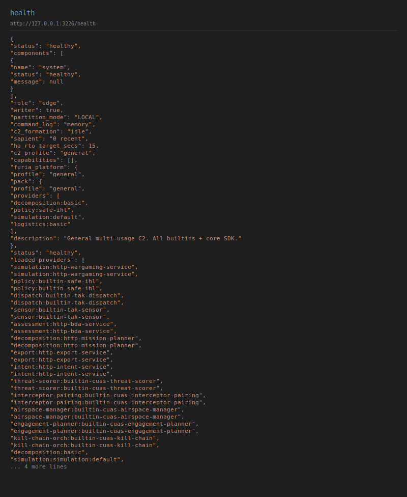
*Service health, C2 profile, loaded providers, platform status*


*Health endpoint — live capture from running interop-gateway*

## Marketplace

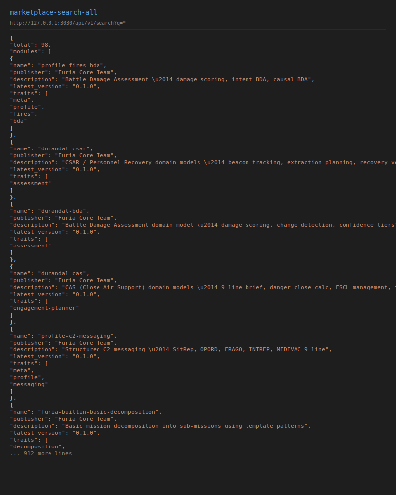
*98 modules in the marketplace (crate seeds + profiles)*


*Marketplace search — all modules listed with names and descriptions*

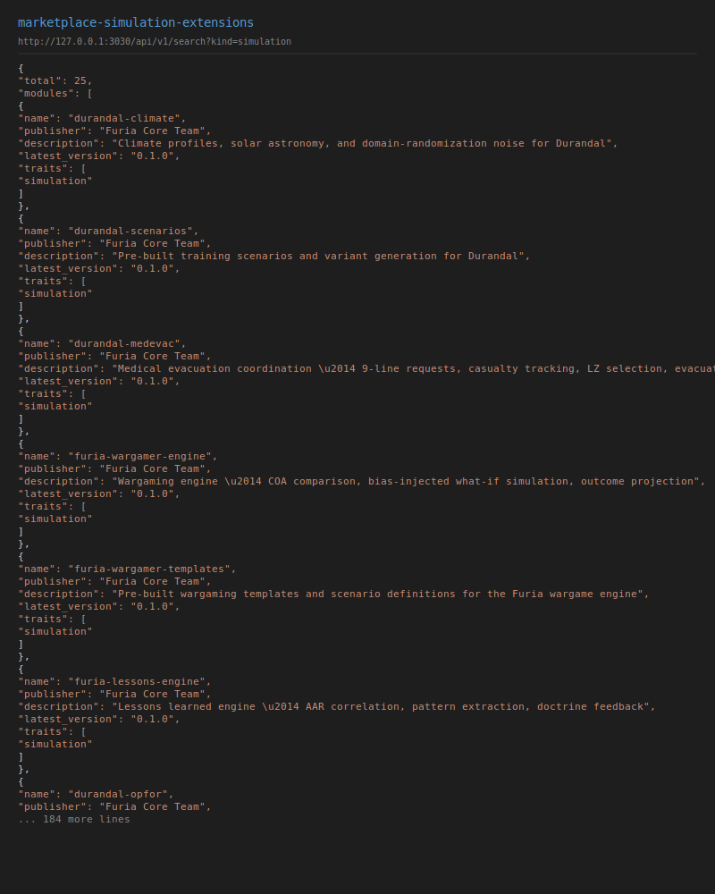
*Filter by kind: 20+ simulation extensions*

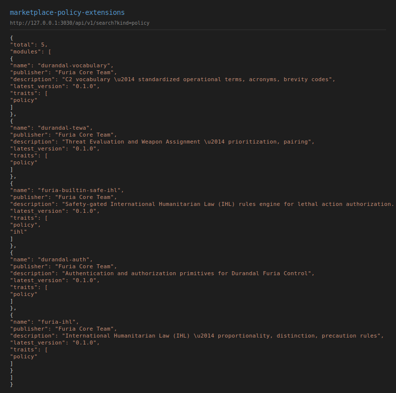
*Filter by kind: 10+ policy extensions*

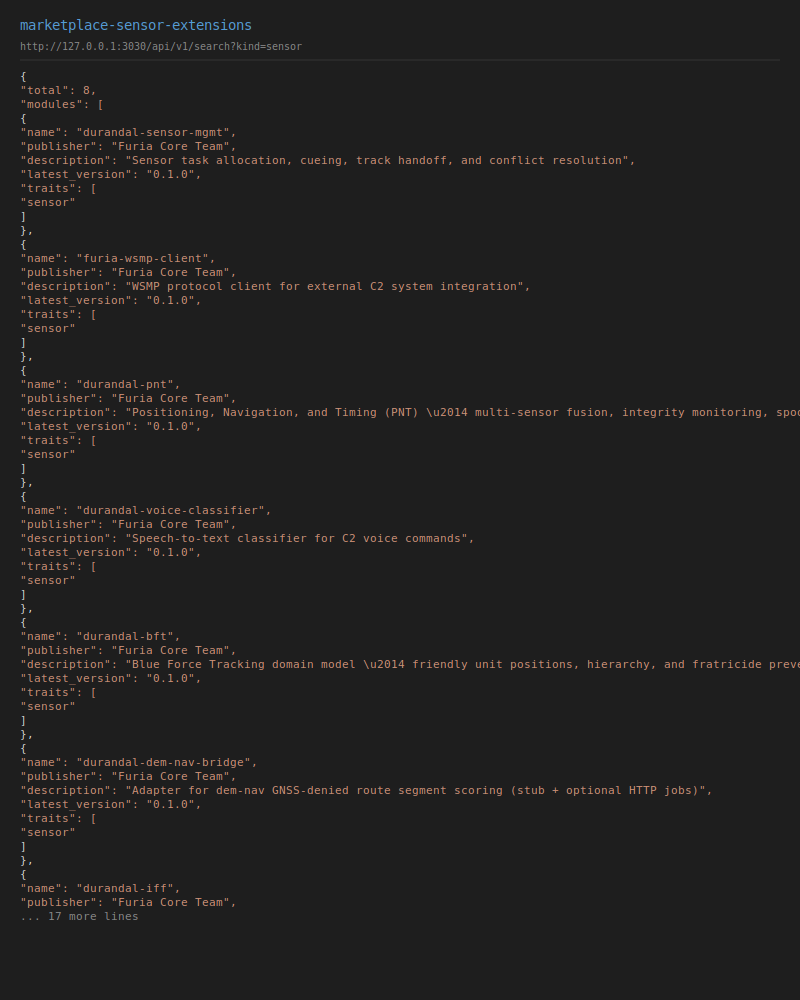
*Filter by kind: 8+ sensor extensions*

## Extension Details

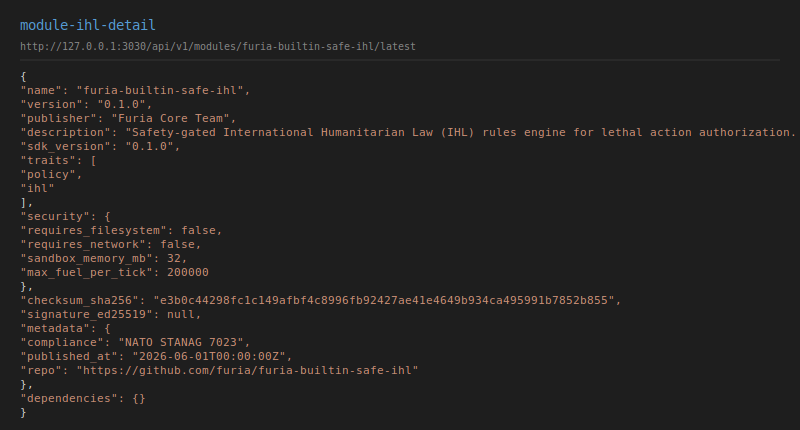
*furia-builtin-safe-ihl — policy, IHL safety gating*

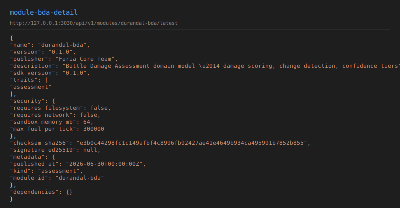
*durandal-bda — assessment, battle damage scoring*

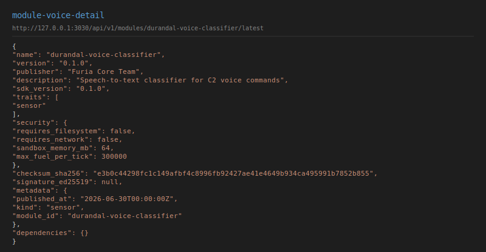
*durandal-voice-classifier — sensor, STT for C2 voice commands*

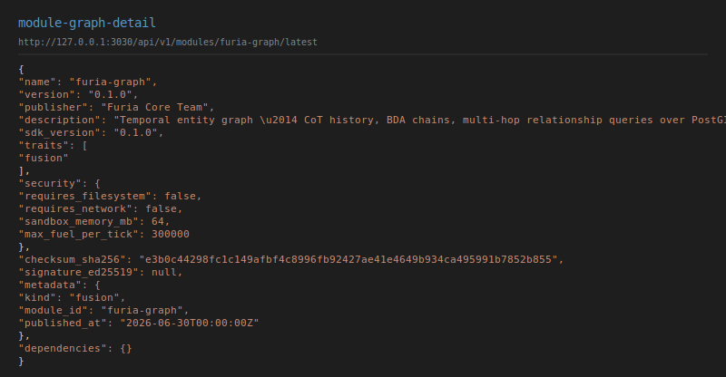
*furia-graph — fusion, temporal entity graph*


*Extension detail view with version, traits, security requirements*

## C2 Profiles

### Counter-UAS (C-UAS)


*profile-c-uas — found in marketplace with 5 extension dependencies*

### C4ISR Headquarters

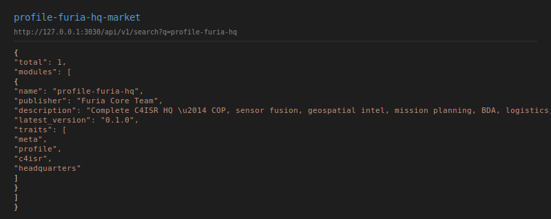
*profile-furia-hq — full HQ with COP, intel, planning, BDA*


*Health endpoint when Furia HQ profile is active*

### Tactical Frontline

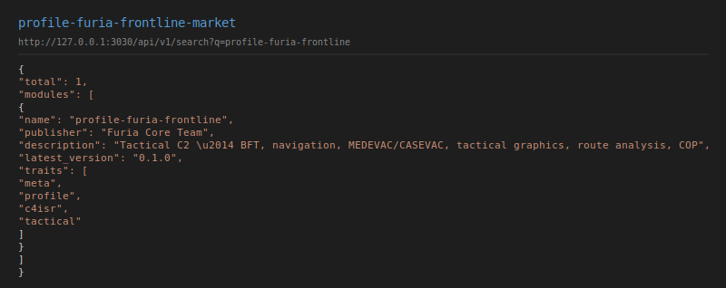
*profile-furia-frontline — dismounted C2 with BFT, MEDEVAC*

### FPV + ISR Reconnaissance

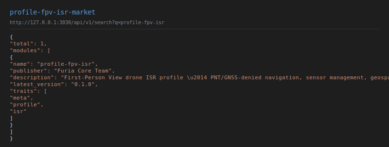
*profile-fpv-isr — single-operator drone ISR*

### Deep ISR Reconnaissance

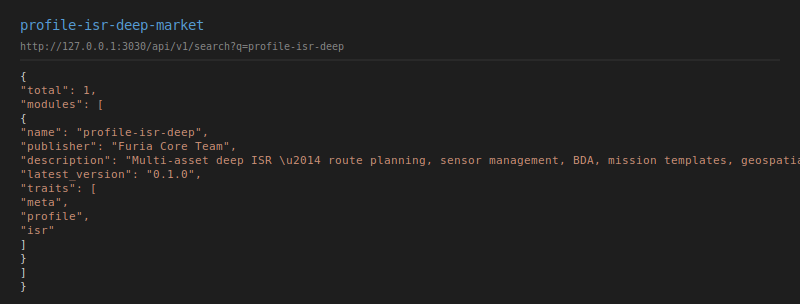
*profile-isr-deep — multi-asset beyond-LOS reconnaissance*

### Search & Strike

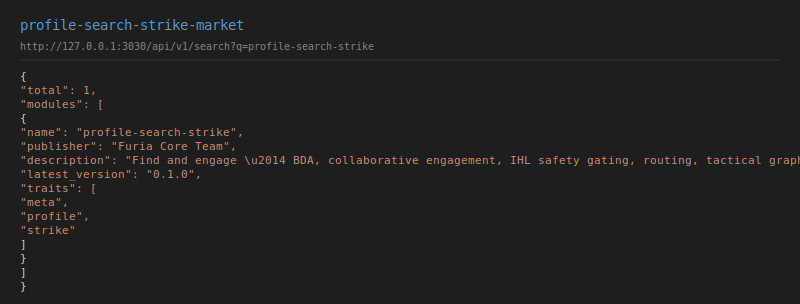
*profile-search-strike — find and engage with IHL gating*

### Manned-Unmanned Teaming

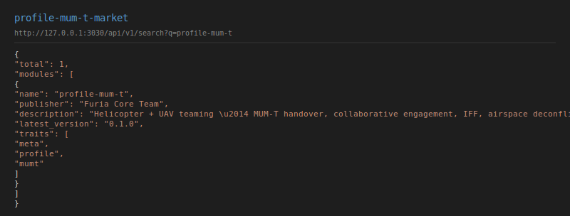
*profile-mum-t — helicopter + UAV teaming*

### Ground Control Station

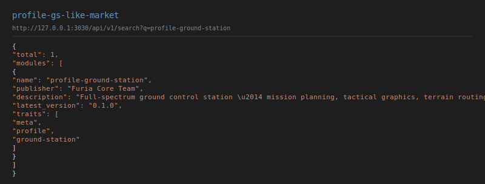
*profile-gs-like — full ground control station*

### Maritime Domain Awareness

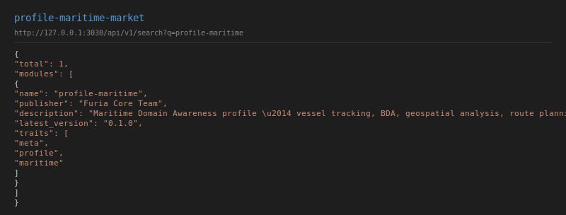
*profile-maritime — vessel tracking, BDA, routing*

### C2 Messaging

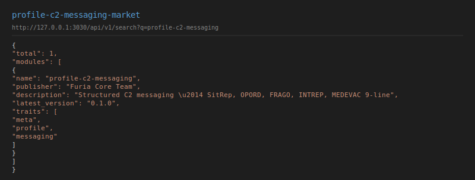
*profile-c2-messaging — SitRep, OPORD, MEDEVAC*

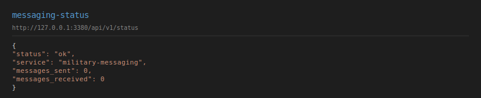
*Military messaging service health*

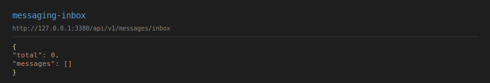
*Message inbox — received SitRep messages*

## Adding More Screenshots

Screenshots are captured by the CI pipeline. To capture locally:

```bash
# 1. Start services
open FuriaC4ISR.app
# or: cargo run --release -p interop-gateway &
#     cargo run --release -p furia-market-server &

# 2. Run capture
python3 docs/mkdocs/scripts/capture-screenshots.py

# 3. Rebuild docs
cd docs/mkdocs && python3 -m mkdocs build
```