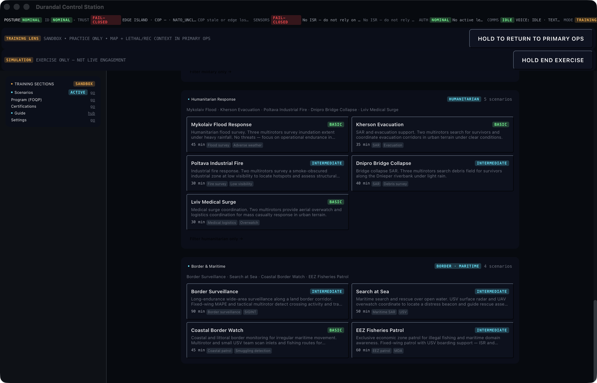

# UI Components & App Layout

The Furia C2 desktop application is built with SolidJS and Tauri.
This guide covers the app layout, available shells, panels, and
how to create custom UIs.

## App Layout

The application is organized into four main areas:

```
┌─────────────────────────────────────────────────────────┐
│ TopBar — Profile-aware navigation tabs                   │
│  [MAP] [MISSION] [MARKETPLACE] [TRAINING] [SETTINGS]     │
├────────┬────────────────────────────────────────────────┤
│        │                                                │
│ Sidebar│              Main Content Area                  │
│ (Left) │         (COP, Mission Plan, Market, etc.)      │
│        │                                                │
│ - Tracks│                                               │
│ - Units │                                               │
│ - Intel │              ┌──────────────────┐             │
│        │              │  Right Panel      │             │
│        │              │  (Contextual)     │             │
│        │              │                   │             │
│        │              │  - Asset Detail   │             │
│        │              │  - Track Info     │             │
│        │              │  - Mission Plan   │             │
│        │              └──────────────────┘             │
├────────┴────────────────────────────────────────────────┤
│ StatusBar — C2 profile, formation mode, service health  │
└─────────────────────────────────────────────────────────┘
```

### TopBar

| Tab | Route | Description |
|-----|-------|-------------|
| **MAP** | `/` | Common Operating Picture — main C2 view |
| **MISSION** | `/mission` | Mission planning, COA development |
| **MARKETPLACE** | `/marketplace` | Extension browser, search, install |
| **TRAINING** | `/training` | Exercise mode with scenario controls |
| **SETTINGS** | `/app-settings` | C2 profile, display, language |

### Sidebar (Left Panel)

| Section | Content |
|---------|---------|
| Tracks | Active sensor tracks, classification, confidence |
| Units | Friendly force units with hierarchy, status |
| Intel | Intelligence reports, BDA assessments |
| BDA | Battle damage assessment summaries |
| Formation | C2 formation members, roles, connectivity |

### Right Panel

The right panel is context-sensitive and changes based on selection:

| Selection | Panel Shows |
|-----------|------------|
| Track on map | Position, velocity, IFF, classification, sensor source |
| Unit in sidebar | Unit details, sub-units, equipment, fuel state |
| Intel report | Report detail, source, confidence, related tracks |
| Mission task | Task status, assigned assets, timeline, location |

### StatusBar

Shows the active C2 profile, formation partition mode, and service health indicators.
Color-coded: green = healthy, yellow = degraded, red = offline.

## Screenshots


*Main C2 interface — map, tracks, sidebar, formation status*


*Extension marketplace — browse and install modules*


*Mission planning — COA development and task assignment*

## Shell System

The shell determines the app layout based on the operator's role:

| Shell | Route | Layout |
|-------|-------|--------|
| `commander` | `/` | Full COP with all panels |
| `rc` | `/rc` | Remote controller — video + telemetry |
| `solo` | `/solo` | Single operator — focused map |
| `training` | `/training` | Training mode with exercise controls |

Shell is selected automatically from the C2 formation template.

## Entry Screen

When the app starts, you choose a template and role:


| Template | Slots | Roles |
|----------|-------|-------|
| **SOLO** | 1 | Single operator |
| **PAIR** | 2 | Leader + RC operator |
| **TOC-3** | 3 | Cmd + Intel + Plans |
| **TOC-6** | 6 | All C2 roles |
| **C-UAS CELL** | 3 | Cmd + CUAS + Sentinel |
| **SITAWARE HQ** | 5 | Cmd + Intel + Plans + Liaison + Coord |
| **FRONTLINE** | 4 | Leader + Observer + RC + Payload |

## Profile-Driven UI

The `c2ProfileStore` automatically configures the UI based on the active C2 profile:

```typescript
// Profile 'cuas' → C-UAS_CELL template, 'cuas' role, CUAS_DEFENSIVE thread
// Profile 'sitaware-hq' → SITAWARE_HQ template, 'leader' role, ISR_ONLY thread
```

## Theme

- Background: near-black (`gray-950`)
- Panels: dark gray (`gray-900`) with `gray-800` borders
- Accent: blue for selections
- Alerts: red for warnings
- Status: green/yellow/red for service health

## Custom UI Components

UI components are available in `furia-core/crates/furia-ui/` for building
custom C2 frontends. These are Rust types for tactical graphics, routing,
and collaborative engagement — reusable across different UI frameworks.
