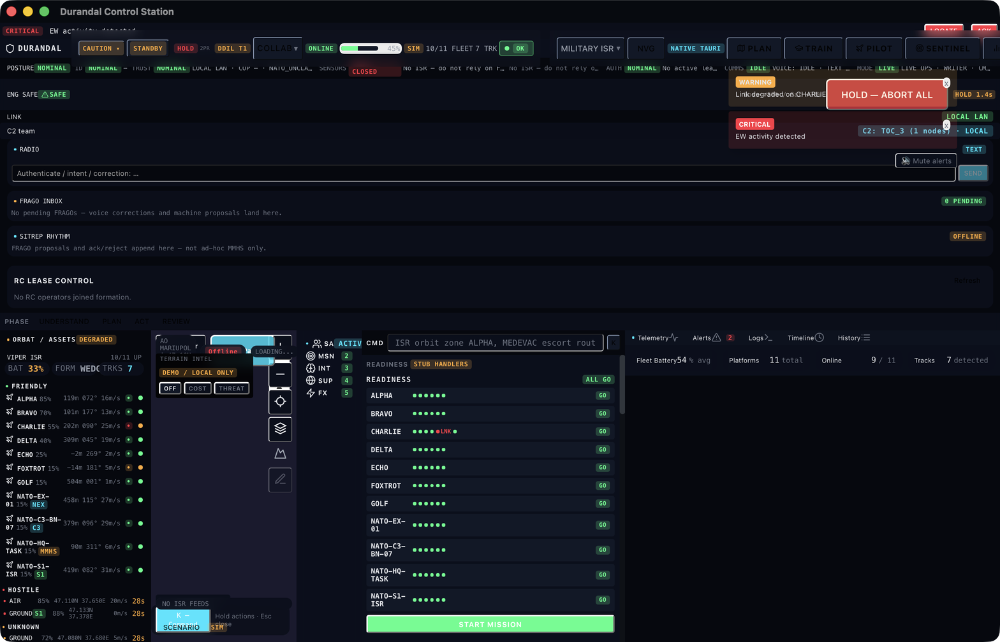

# UI Components & App Layout

The Furia C2 desktop application is built with SolidJS and Tauri.
This guide covers the app layout, available shells, panels, and
how to create custom UIs.

## App Layout

```
┌─────────────────────────────────────────────────────────┐
│ TopBar                                                    │
│  [MAP] [MISSION] [MARKETPLACE] [TRAINING] [SETTINGS]    │
├────────┬────────────────────────────────────────────────┤
│        │                                                │
│ Sidebar│              Main Content                       │
│ (Left) │         (COP, Plan, Market, etc.)              │
│        │                                                │
│ - Tracks│                                               │
│ - Units │                                               │
│ - Intel │              ┌──────────────────┐             │
│ - BDA  │              │  Right Panel     │             │
│        │              │  (Contextual)    │             │
│        │              │                  │             │
│        │              │  - Asset Detail  │             │
│        │              │  - Track Info    │             │
│        │              │  - Mission Plan  │             │
│        │              └──────────────────┘             │
├────────┴────────────────────────────────────────────────┤
│ StatusBar  [Profile: CUAS] [Formation: SOLO] [Health]   │
└─────────────────────────────────────────────────────────┘
```

## Layout Structure

The app is built around a **flexible layout system** that adapts
to the selected C2 profile and formation template.

### TopBar

The main navigation bar with profile-specific tabs:

| Tab | Route | Available In |
|-----|-------|--------------|
| **MAP** | `/` | All profiles |
| **MISSION** | `/mission` | HQ, Planning |
| **MARKETPLACE** | `/marketplace` | All profiles |
| **TRAINING** | `/training` | All profiles |
| **SETTINGS** | `/app-settings` | All profiles |



### Sidebar (Left Panel)

Contextual panel showing active tracks, units, and data:

| View | Content |
|------|---------|
| COP | Active tracks, sensor feeds, formation nodes |
| Intel | Intel reports, BDA assessments |
| Planning | Mission timeline, COA options |
| Marketplace | Module list, kind filter, search |

### Right Panel

Dynamic panel that changes based on selection:

| Selection | Panel Content |
|-----------|--------------|
| Track | Position, velocity, classification, IFF |
| Asset | Sensors, weapons, fuel state, health |
| Mission | Tasks, timeline, assigned assets |
| Module | Manifest, version, security, deps |

## Shells (FuriaShell)

The shell system determines the app's behavior based on the
operator's role and formation template:

| Shell | Route | Use Case |
|-------|-------|----------|
| `commander` | `/` | Full COP with all panels |
| `rc` | `/rc` | Remote controller — video + telemetry |
| `solo` | `/solo` | Single operator — focused map |
| `training` | `/training` | Training mode with exercise controls |

### Shell Selection by Template

```typescript
SOLO → solo shell:  '/solo'
PAIR → commander shell: '/'
TOC_3 → commander shell: '/'
SITAWARE_HQ → commander shell: '/'
FRONTLINE → commander shell: '/'
```

## Entry Screen

When the app starts, you choose a C2 formation template:


| Template | Slots | Max RC | Use Case |
|----------|-------|--------|----------|
| **SOLO** | 1 operator | 2 | Single operator |
| **PAIR** | Leader + RC | 4 | Two operator |
| **TOC-3** | CMD + Intel + Plans | 6 | Small TOC |
| **TOC-6** | 6 roles | 12 | Full TOC |
| **FIRES CELL** | CMD + Fires | 8 | Fires coordination |
| **C-UAS CELL** | CMD + CUAS + Sentinel | 8 | Counter-drone |
| **SITAWARE HQ** | CMD + Intel + Plans + Liaison | 6 | C4ISR HQ |
| **FRONTLINE** | Leader + Observer + RC | 4 | Tactical C2 |

## C2 Profile Integration

The `c2ProfileStore` drives UI defaults based on the active profile:

```typescript
// profile === 'cuas'
// → Auto-selects C-UAS_CELL template
// → Sets role to 'cuas'
// → Sets mission thread to 'CUAS_DEFENSIVE'

// profile === 'sitaware-hq'
// → Auto-selects SITAWARE_HQ template
// → Sets role to 'leader'
// → Sets mission thread to 'ISR_ONLY'
```

## Extension UI Plugins

Extensions can provide UI components via the `UiPlugin` trait.
Currently available UI plugin extensions:

| Extension | Type | Purpose |
|-----------|------|---------|
| `durandal-voice-server` | ui-plugin | Voice pipeline, hotword detection |

## Theme & Styling

The app uses a dark theme based on military C2 conventions:

- Background: `gray-950` (near black)
- Panels: `gray-900` with `gray-800` borders
- Accent: `blue-700/900` for selection
- Alerts: `red-800/900` for warnings
- Text: `gray-100` primary, `gray-400` secondary

## Custom UI Components (furia-ui)

The public UI toolkit at `furia-core/crates/furia-ui/` provides
reusable components for building custom C2 UIs:

```rust
// Import components from the UI toolkit
use furia_ui::components::*;
```

## Adding a New Shell

1. Add type to `FuriaShell` in `c2FormationClient.ts`
2. Register in `registry.ts`
3. Create route in `App.tsx`
4. Add template mapping in `entryArchetypeMatrix.ts`
5. Define cell slots in `templateManifest.ts`

## Adding a New Template

1. Add to `C2Template` type union
2. Add button in `EntryScreen.tsx`
3. Add roles in `entryArchetypeMatrix.ts`
4. Add manifest in `templateManifest.ts`
5. (Optional) Add profile-driven auto-select in `EntryScreen.tsx`